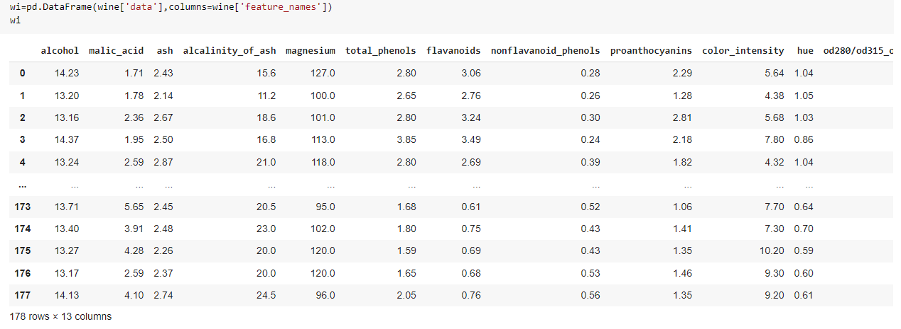
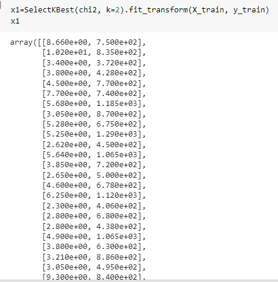
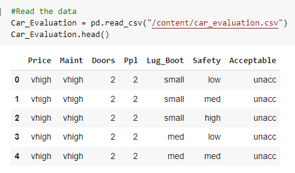

# Car evaluation and Wine Classification. 

## Descriptin
In this assignment, We load wine dataset. There are 3 classes in this dataset, and each sample in this dataset has 13 features.

We split the data into 60% training , 40% testing.

### Models:-
- Naive Bias Model.

 We train the model on training set. We use Naïve Bayes Model for solving classification problems and the model accuracy is 99%.

We use SelectKBest () method to select the best two features. And the best two 
features were (color_intensity , proline).

We used the two features to train the model and the model accuracy became 90%. 

- KNN Classifier.

we installed car evaluation dataset from Kaggle as csv file.
then, we used .head() to show first 5 rows.

and train the model

# Conclusion

From applying KNN model, we found that:
1. According to point(c), after we are modeling the car evaluation with KNN 
algorithm. when we use 10%, 20%, 30%, 40%, 50%, 60%, 70%, 80%, 90% and 
100% of the training set for 10 separate KNN classifiers we notice that the 
performance increase as training set increase.

✓ Note: The variance and testing sets become more closer to each other which avoid overfitting.

2. According to point(d), when we use 100% training set and varying with k from 1 to 10, we notice that the best k in 5 and 8 but 5 is more efficient because the variance between testing and validation is very small than k=8. Another reason 
makes k=5 is best is avoiding our model to become confused in future unseen data if the two classes have the same amount of points (4 points in each).

✓ Note: It prefers selecting an odd value for K to get the best accuracy.

3. According to point(e), when we analyze the training time by using different 
number of training samples, we notice the training time become little bit larger 
when the k =2 which is make sense because it makes more calculation.

✓ Note: The size of the samples doesn’t have affection on the time of training and prediction.
